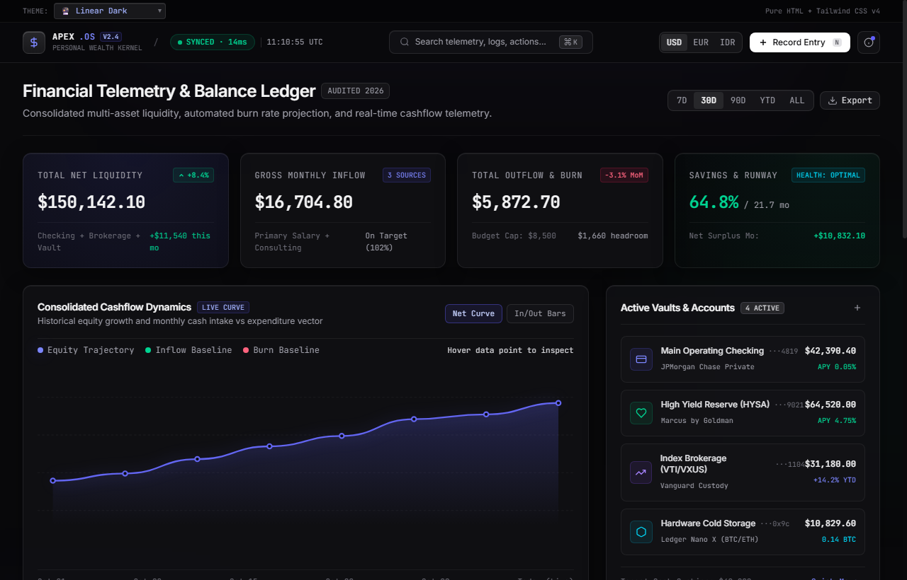
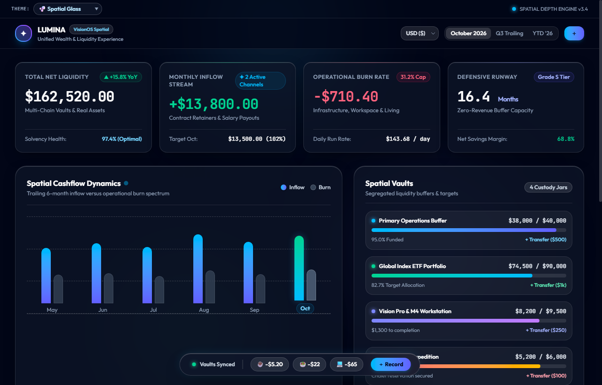
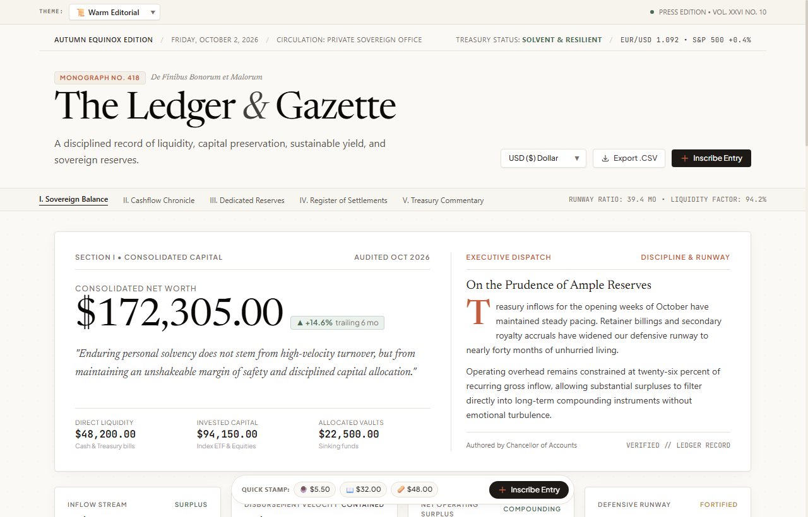
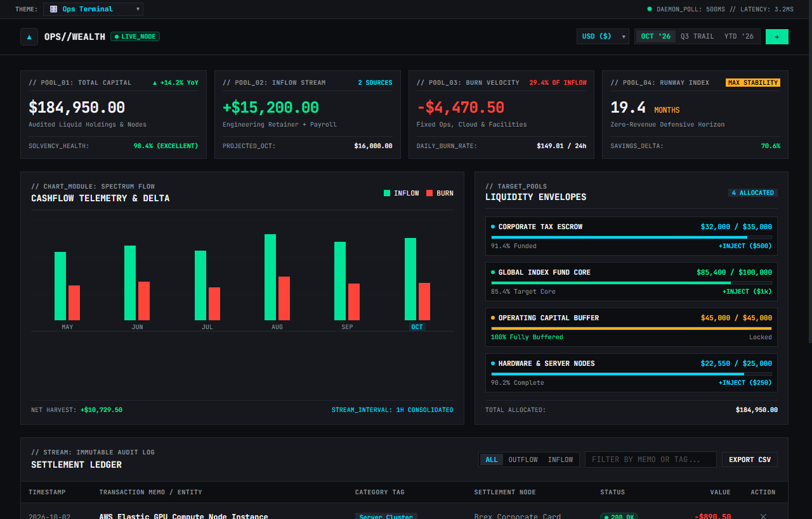
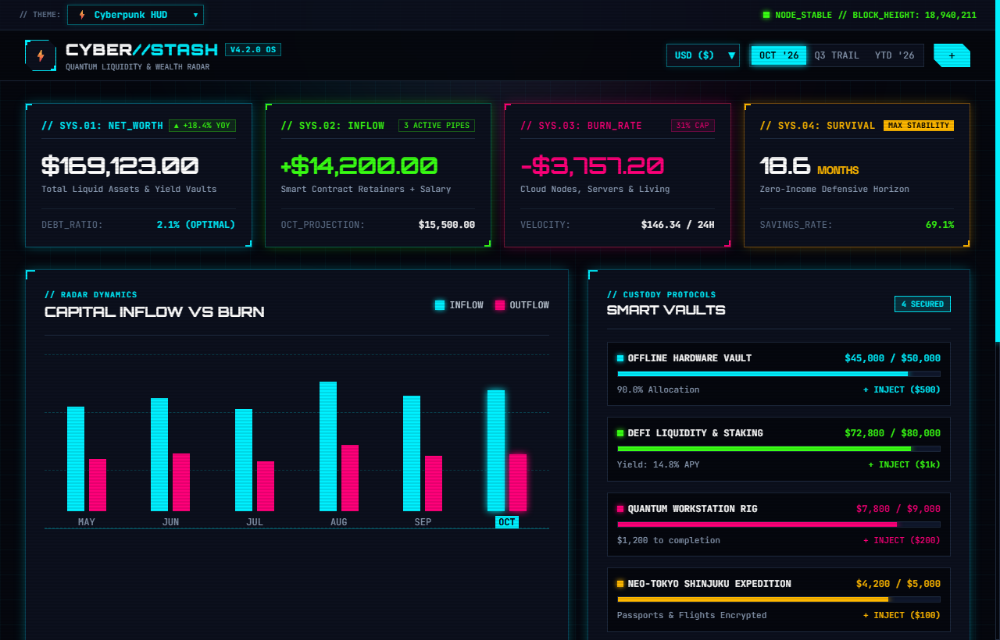
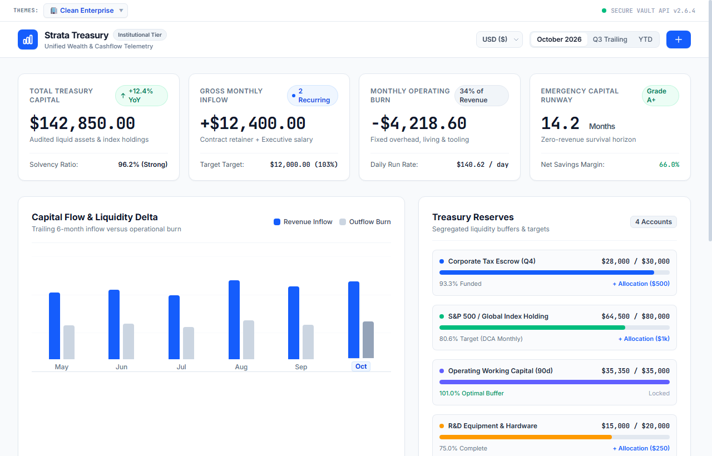
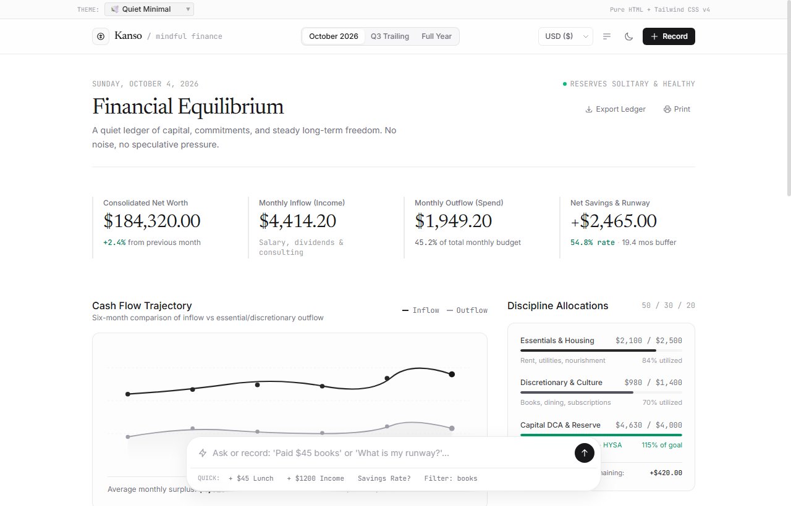
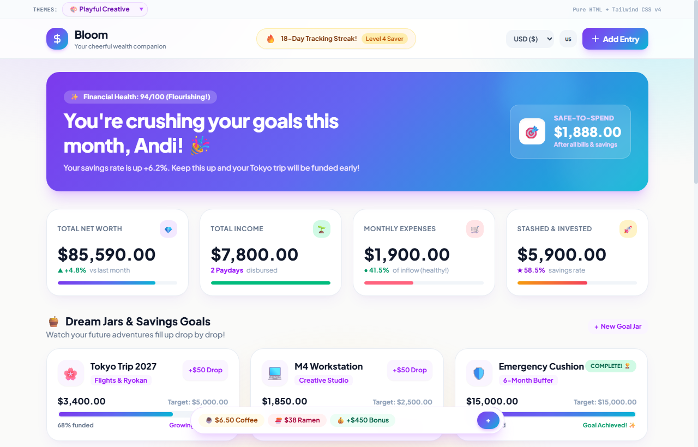
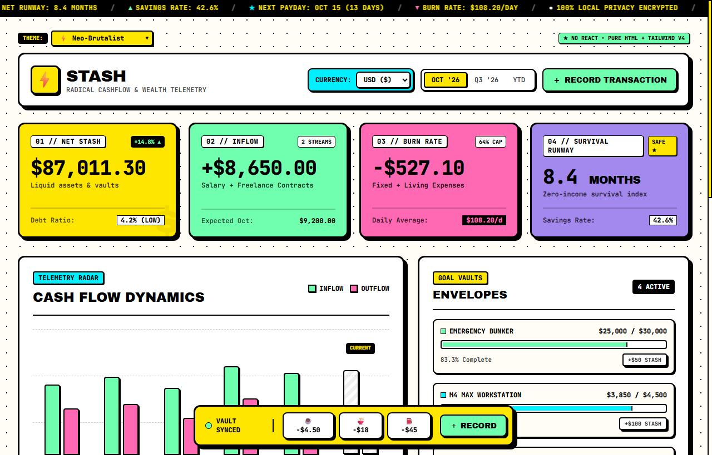

# Agentic UI Design Skills — Fullstack Web App & Dashboard Systems

Kumpulan **Visual Design Skills** untuk AI coding assistant (Antigravity/agentic IDE) yang dikhususkan untuk merancang **antarmuka aplikasi web fullstack, interior produk SaaS, dan dashboard operasional**.

Tersimpan di dalam direktori `.agents/skills/`, setiap skill menyediakan guardrails estetika terperinci (token warna, tipografi, batas densitas data, dan adaptasi responsif). File di dalam `showcases/` adalah **living showcase** berupa dashboard manajemen keuangan yang dihasilkan langsung oleh AI agen untuk membuktikan keandalan masing-masing skill.

---

## 🎯 Tujuan & Niche Fokus (The Core Purpose)

Kebanyakan panduan desain dan generator AI di internet hanya bagus untuk membuat *landing page marketing*, namun kerap menghasilkan tampilan yang steril, berantakan, atau generik saat diminta membuat **interior aplikasi nyata**. 

Repository ini secara spesifik mengatasi masalah tersebut dengan fokus pada:
- **Komponen Stateful & Padat Data:** Kartu metrik KPI, tabel data tabular, panel filter, modal form aksi, dan progress alokasi dana.
- **Hierarki Interior SaaS:** Navigasi aplikasi, density padding, kontras teks WCAG, dan tipografi monospaced untuk angka keuangan/telemetri.
- **Zero-Build Architecture:** Seluruh output showcase membuktikan bahwa antarmuka kompleks dapat dibangun secara responsif hanya dengan **HTML5 + Tailwind CSS v4 Browser Engine + Vanilla JS**.

---

## 🏗️ Structural Skill Khusus: `landing-page-anatomy`

Ingin membangun **Landing Page dengan konversi tinggi** menggunakan visual style apa pun di bawah? Tersedia skill struktural terpisah:
- **Lokasi:** [`.agents/skills/landing-page-anatomy/SKILL.md`](./.agents/skills/landing-page-anatomy/SKILL.md)
- **Fungsi:** Mengatur arsitektur konversi landing page (Hero Section, Social Proof Logo Cloud, Bento Grid Features, Alternating Deep-Dives, Interactive Pricing Matrix, FAQ Accordion, dan Closing Anchor CTA).
- **Plug-and-Play Pairing:** Skill ini murni struktural dan dapat **dikombinasikan dengan 9 visual style mana pun**:
  ```text
  /style-linear-dark with /landing-page-anatomy create a high-converting landing page for an AI developer platform
  ```

---

## 📂 Pemetaan 9 Visual Style & Output Showcase

| Skill Name | Niche & Karakteristik Utama | Output Showcase (HTML) | Fleksibilitas Landing Page |
|---|---|---|:---:|
| **`style-linear-dark`** | Developer tools, task tracking, ultra-sleek dark mode ala Linear & Raycast dengan inset borders. | [`showcases/dashboard-linear.html`](./showcases/dashboard-linear.html) | ⭐⭐⭐ (Sangat Cocok) |
| **`style-ops-terminal`** | Telemetry cockpit, server observability, dan tabular data berkepadatan tinggi ala Datadog & Grafana. | [`showcases/dashboard-ops-terminal.html`](./showcases/dashboard-ops-terminal.html) | ⭐ (Khusus App/Cockpit) |
| **`style-clean-enterprise`** | B2B SaaS portal, back-office admin, and accounting UI yang reliabel ala Stripe & TailwindUI. | [`showcases/dashboard-enterprise.html`](./showcases/dashboard-enterprise.html) | ⭐⭐ (B2B SaaS Landing) |
| **`style-spatial-glass`** | Luminous depth, frosted glassmorphism, dan ambient light cones terinspirasi VisionOS & macOS. | [`showcases/dashboard-spatial.html`](./showcases/dashboard-spatial.html) | ⭐⭐⭐ (Tech/Crypto Showcase) |
| **`style-warm-editorial`** | Kanvas kertas hangat (`#FBF9F5`), Newsreader serif, drop-cap, dan hairline rules ala Substack & ReadCV. | [`showcases/dashboard-editorial.html`](./showcases/dashboard-editorial.html) | ⭐⭐⭐ (Blog/Portfolio/Essay) |
| **`style-neo-brutalism`** | High-energy retro indie app, border 2–3px hitam solid, dan hard offset shadows ala Gumroad. | [`showcases/dashboard-neo-brutalism.html`](./showcases/dashboard-neo-brutalism.html) | ⭐⭐⭐ (Indie Product Launch) |
| **`style-cyberpunk-hud`** | Sci-fi telemetry HUD, chamfered corner, dan terminal glow neon menyala ala Web3 gaming portal. | [`showcases/dashboard-cyberpunk.html`](./showcases/dashboard-cyberpunk.html) | ⭐⭐ (Gaming/Web3 dApp) |
| **`style-quiet-minimal`** | Filosofi Kanso Jepang: rendah distraksi, whisper borders, dan fokus konten mendalam ala Notion & Claude. | [`showcases/dashboard-quiet.html`](./showcases/dashboard-quiet.html) | ⭐⭐ (Minimalist Product Page) |
| **`style-playful-creative`** | Pendekatan ramah, rounded pill lembut, dan micro-interaction energetik ala Duolingo & Canva. | [`showcases/dashboard-playful.html`](./showcases/dashboard-playful.html) | ⭐⭐⭐ (B2C/EdTech App) |

---

## 📸 Visual Showcase Previews

Di bawah ini adalah tangkapan layar langsung dari output masing-masing style tanpa Anda perlu meng-clone atau menjalankan repositori secara lokal:

### 1. 🔮 Linear Dark
> Developer-centric dark mode dengan inset borders, aksen indigo, dan hierarki presisi ala Linear & Raycast.

[](./showcases/dashboard-linear.html)
*File Showcase:* [`showcases/dashboard-linear.html`](./showcases/dashboard-linear.html) • *Definisi Skill:* [`.agents/skills/style-linear-dark/SKILL.md`](./.agents/skills/style-linear-dark/SKILL.md)

---

### 2. 🫧 Spatial Glass
> Frosted glassmorphism transparan berlapis dengan specular top edge highlight dan ambient light glow ala VisionOS & macOS.

[](./showcases/dashboard-spatial.html)
*File Showcase:* [`showcases/dashboard-spatial.html`](./showcases/dashboard-spatial.html) • *Definisi Skill:* [`.agents/skills/style-spatial-glass/SKILL.md`](./.agents/skills/style-spatial-glass/SKILL.md)

---

### 3. 📜 Warm Editorial
> Kanvas kertas hangat (`#FBF9F5`), tipografi serif Newsreader, drop-cap artikel, dan hairline ink rules ala Substack & digital journalism.

[](./showcases/dashboard-editorial.html)
*File Showcase:* [`showcases/dashboard-editorial.html`](./showcases/dashboard-editorial.html) • *Definisi Skill:* [`.agents/skills/style-warm-editorial/SKILL.md`](./.agents/skills/style-warm-editorial/SKILL.md)

---

### 4. 🎛️ Ops Terminal
> High-density telemetry dashboard layaknya Datadog, Grafana, dan Bloomberg Terminal dengan data tabular monospaced.

[](./showcases/dashboard-ops-terminal.html)
*File Showcase:* [`showcases/dashboard-ops-terminal.html`](./showcases/dashboard-ops-terminal.html) • *Definisi Skill:* [`.agents/skills/style-ops-terminal/SKILL.md`](./.agents/skills/style-ops-terminal/SKILL.md)

---

### 5. ⚡ Cyberpunk HUD
> Antarmuka sci-fi berenergi tinggi dengan chamfered cards, grid scanline, serta aksen neon cyan dan neon green menyala.

[](./showcases/dashboard-cyberpunk.html)
*File Showcase:* [`showcases/dashboard-cyberpunk.html`](./showcases/dashboard-cyberpunk.html) • *Definisi Skill:* [`.agents/skills/style-cyberpunk-hud/SKILL.md`](./.agents/skills/style-cyberpunk-hud/SKILL.md)

---

### 6. 🏢 Clean Enterprise
> Standar B2B SaaS korporat yang rapi, solid, dan terpercaya ala Stripe & TailwindUI dengan kepatuhan kontras WCAG AA.

[](./showcases/dashboard-enterprise.html)
*File Showcase:* [`showcases/dashboard-enterprise.html`](./showcases/dashboard-enterprise.html) • *Definisi Skill:* [`.agents/skills/style-clean-enterprise/SKILL.md`](./.agents/skills/style-clean-enterprise/SKILL.md)

---

### 7. 🕊️ Quiet Minimal
> Filosofi Kanso Jepang: rendah distraksi, tipografi tenang, border halus, dan fokus konten mendalam ala Notion & Claude.

[](./showcases/dashboard-quiet.html)
*File Showcase:* [`showcases/dashboard-quiet.html`](./showcases/dashboard-quiet.html) • *Definisi Skill:* [`.agents/skills/style-quiet-minimal/SKILL.md`](./.agents/skills/style-quiet-minimal/SKILL.md)

---

### 8. 🎨 Playful Creative
> Warna-warni ceria, rounded pill lembut, micro-interaction energetik, dan maskot bersahabat ala Duolingo & Lemon Squeezy.

[](./showcases/dashboard-playful.html)
*File Showcase:* [`showcases/dashboard-playful.html`](./showcases/dashboard-playful.html) • *Definisi Skill:* [`.agents/skills/style-playful-creative/SKILL.md`](./.agents/skills/style-playful-creative/SKILL.md)

---

### 9. ⚡ Neo-Brutalist
> Border hitam tebal (2–3px), warna kuning tegas, hard offset drop shadow tanpa blur, dan badge kontras tinggi ala Gumroad.

[](./showcases/dashboard-neo-brutalism.html)
*File Showcase:* [`showcases/dashboard-neo-brutalism.html`](./showcases/dashboard-neo-brutalism.html) • *Definisi Skill:* [`.agents/skills/style-neo-brutalism/SKILL.md`](./.agents/skills/style-neo-brutalism/SKILL.md)

---

## 🛠️ Struktur Repository

```text
├── .agents/
│   └── skills/                         # Koleksi 10 Skill (9 Visual + 1 Structural)
│       ├── landing-page-anatomy/       # Arsitektur Konversi Landing Page
│       ├── style-clean-enterprise/     # B2B SaaS & Admin Portals
│       ├── style-cyberpunk-hud/        # Sci-Fi Telemetry & Web3 Gaming
│       ├── style-linear-dark/          # Developer-Centric Dark Mode
│       ├── style-neo-brutalism/        # Tactile Retro Indie Tools
│       ├── style-ops-terminal/         # High-Density Observability Cockpit
│       ├── style-playful-creative/     # B2C, EdTech & Creative Web Apps
│       ├── style-quiet-minimal/        # Content-First Low-Distraction Tools
│       ├── style-spatial-glass/        # VisionOS Frosted Glassmorphism
│       └── style-warm-editorial/       # Swiss Paper Publishing & Finance
│
├── assets/
│   └── screenshots/                   # Tangkapan layar preview tiap showcase
│       ├── clean-enterprise.png
│       ├── cyberpunk-hud.png
│       ├── linear-dark.png
│       ├── neo-brutalist.png
│       ├── ops-terminal.png
│       ├── playful-creative.png
│       ├── quiet-minimal.png
│       ├── spatial-glass.png
│       └── warm-editorial.png
│
├── showcases/                          # 9 Living showcase dashboard output
│   ├── dashboard-cyberpunk.html
│   ├── dashboard-editorial.html
│   ├── dashboard-enterprise.html
│   ├── dashboard-linear.html
│   ├── dashboard-neo-brutalism.html
│   ├── dashboard-ops-terminal.html
│   ├── dashboard-playful.html
│   ├── dashboard-quiet.html
│   └── dashboard-spatial.html
│
├── index.html                          # Showcase gallery & launcher portal
└── README.md
```

---

## 💡 Cara Menggunakan Skill di Proyek Nyata

Skill dirancang modular agar dapat di-copy secara mandiri ke proyek fullstack Anda tanpa membawa seluruh isi repositori:

1. **Salin Satu Skill ke Proyek Anda:**
   ```bash
   # Contoh: hanya membutuhkan style enterprise untuk proyek admin portal Anda
   cp -r .agents/skills/style-clean-enterprise /path/to/my-project/.agents/skills/
   ```

2. **Panggil Skill Saat Prompting AI:**
   Gunakan slash command atau sebutkan nama skill dalam instruksi:
   ```text
   /style-clean-enterprise buatkan halaman manajemen inventori dan mutasi stok dengan HTML + Tailwind CSS
   ```
   AI agent akan mematuhi token warna, hierarki tabel data, status badges, dan batas layout yang tertera di dalam `SKILL.md`.

---

## 🌐 Menjalankan Output Showcase

Output dashboard dapat dibuka langsung di browser:
- Buka [**`index.html`**](./index.html) di root repositori untuk melihat katalog galeri dan meluncurkan tema yang dipilih.
- Seluruh output telah dilengkapi fitur **theme switcher dropdown** di header untuk berpindah antar variasi output secara langsung.

---

## 📄 Lisensi

Didistribusikan di bawah lisensi [**MIT License**](./LICENSE). Bebas digunakan, dimodifikasi, dan diintegrasikan ke dalam proyek personal maupun komersial Anda.
